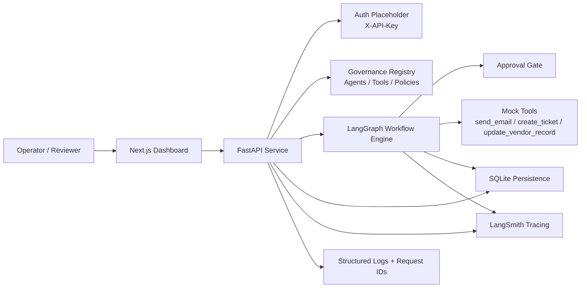

# Agent Governance Observability

[](https://www.python.org/)
[](https://fastapi.tiangolo.com/)
[](https://nextjs.org/)
[](https://www.langchain.com/langgraph)
[](https://smith.langchain.com/)
[](https://www.sqlite.org/)

Production-aware proof of concept for **governing, observing, and safely operating AI agents**.

This project is not a chatbot demo. It is a minimal **control layer for agentic systems**: a small but realistic platform pattern for ownership, policy enforcement, approval gates, auditability, and runtime visibility before autonomous workflows touch real enterprise systems.

## Highlights

- **Governance-first design**: explicit ownership, risk tiers, tool permissions, approval gates
- **Production-aware runtime**: structured logs, request IDs, health checks, retry-safe resume behavior
- **Observable workflows**: LangGraph state, run events, audit trail, LangSmith tracing hooks
- **Operator controls**: approval queue, policy blocking, kill switch, paused-run resume
- **CTO-demo ready**: polished dashboard, API docs, smoke tests, and realistic enterprise framing

## Table Of Contents

- [Why This Project Exists](#why-this-project-exists)
- [What It Demonstrates](#what-it-demonstrates)
- [Demo Workflow](#demo-workflow)
- [Architecture](#architecture)
- [Product Walkthrough](#product-walkthrough)
- [Stack](#stack)
- [Repository Layout](#repository-layout)
- [Key Backend Capabilities](#key-backend-capabilities)
- [API Surface](#api-surface)
- [Quick Start](#quick-start)
- [Configuration](#configuration)
- [LangSmith Tracing](#langsmith-tracing)
- [Testing](#testing)
- [Manual Demo Flow](#manual-demo-flow)
- [Why This Matters](#why-this-matters)
- [Roadmap](#roadmap)

## Why This Project Exists

As soon as AI agents can call tools, update records, send outbound communications, or process sensitive documents, the problem is no longer just model quality. The real challenge becomes operational control:

- Who owns each agent?
- Which tools is it allowed to use?
- Which actions require human approval?
- How do you inspect what happened during a run?
- How do you stop or pause a risky workflow?

This PoC demonstrates one pragmatic answer to those questions.

## What It Demonstrates

- agent registry with owner and team mapping
- risk tiers: `low`, `medium`, `high`
- tool-level permission controls
- policy enforcement before execution
- human-in-the-loop approval for high-risk actions
- durable workflow state with resumable approvals
- structured logs, request IDs, and run event timelines
- LangSmith tracing hooks for workflow observability
- kill switch and pause controls
- production-aware API patterns and dashboard surfaces

## Demo Workflow

The showcase workflow is intentionally simple and realistic:

`document intake -> classify -> policy check -> approval gate -> tool execution -> finalize`

That keeps the demo implementable while still showing the core governance mechanics needed for enterprise agent operations.

## Architecture



## Product Walkthrough

### Overview Dashboard

Executive summary of governed agent activity, approval pressure, blocked runs, and simulated usage economics.


### Agent Registry

An inventory of registered agents with ownership, team mapping, risk classification, and allowed tool surfaces.


### Run Explorer

Operational console for workflow runs, including risk labels, execution status, filters, and drill-down into individual runs.


### Approval Queue

Human review surface for high-risk runs that must pause before governed execution can continue.


### API Documentation

OpenAPI documentation for the FastAPI backend, including workflow, observability, health, and operator-control endpoints.


## Screens At A Glance

| Surface | Purpose |
| --- | --- |
| `Overview` | Executive summary of run health, approval pressure, and simulated usage economics |
| `Agent Registry` | Inventory of governed agents, ownership, risk, and approved tools |
| `Run Explorer` | Workflow visibility with statuses, risk filters, and drill-down |
| `Approval Queue` | Human-in-the-loop review surface for high-risk runs |
| `API Docs` | Clear backend contract for workflow, governance, and observability endpoints |

## Stack

- Python 3.11+
- FastAPI
- LangGraph
- LangChain
- LangSmith
- SQLite
- Next.js
- SQLAlchemy

## Repository Layout

- `backend/` FastAPI service, LangGraph workflow engine, governance models, tests
- `frontend/` Next.js dashboard for operators and reviewers
- `docs/` product spec, architecture notes, and roadmap
- `infra/` local infrastructure scaffolding
- `scripts/` helper and smoke-test scripts
- `images/` screenshots for the public project walkthrough

## Key Backend Capabilities

- typed workflow state for LangGraph runs
- SQLite persistence for `agents`, `agent_tools`, `policies`, `runs`, `approvals`, `run_events`
- resumable approval flow for high-risk actions
- tool-level policy checks before execution
- structured JSON logging
- request IDs returned via `X-Request-ID`
- health endpoint and API docs
- simple auth placeholder for protected API access
- retry-safe graph resume behavior

## API Surface

Primary docs are available locally through:

- [Swagger UI](http://localhost:8000/docs)
- [ReDoc](http://localhost:8000/redoc)

Core endpoints:

- `GET /health`
- `GET /api/v1/agents`
- `POST /api/v1/runs`
- `GET /api/v1/runs`
- `GET /api/v1/runs/{id}`
- `GET /api/v1/runs/{id}/events`
- `GET /api/v1/approvals/pending`
- `POST /api/v1/approvals/{run_id}/approve`
- `POST /api/v1/approvals/{run_id}/reject`
- `POST /api/v1/runs/{id}/kill`

## Quick Start

Get the backend and dashboard running locally in a few minutes.

### Backend

```bash
cd backend
python3.11 -m venv .venv
source .venv/bin/activate
pip install -e '.[dev]'
cp ../.env.example .env
uvicorn app.main:app --reload --port 8000
```

### Frontend

```bash
cd frontend
npm install
cp ../.env.example .env.local
npm run dev
```

Local URLs:

- Dashboard: [http://localhost:3000](http://localhost:3000)
- API: [http://localhost:8000](http://localhost:8000)
- Swagger: [http://localhost:8000/docs](http://localhost:8000/docs)

## Configuration

Start from `.env.example`.

Important settings:

- `APP_ENV`, `APP_VERSION`, `LOG_LEVEL`
- `API_BASE_PATH`, `API_CORS_ORIGINS`
- `DATABASE_URL`
- `AUTH_ENABLED`, `DEMO_API_KEY`
- `LANGSMITH_TRACING`, `LANGSMITH_API_KEY`, `LANGSMITH_PROJECT`, `LANGSMITH_ENDPOINT`
- `OPENAI_API_KEY`
- `NEXT_PUBLIC_API_BASE_URL`

### Auth Placeholder

The backend includes a simple demo auth mode:

- set `AUTH_ENABLED=true`
- set `DEMO_API_KEY=<shared-demo-key>`
- send `X-API-Key: <shared-demo-key>` with API requests

This is intentionally lightweight. It exists to show where authentication and protected control-plane access would sit in a real deployment.

## LangSmith Tracing

Tracing is enabled when:

- `LANGSMITH_TRACING=true`
- `LANGSMITH_API_KEY` is set

When enabled, the backend traces:

- root workflow runs
- classification
- tool execution
- approval decisions
- final structured output

Each workflow trace includes governance metadata such as `agent_id`, `owner`, `risk_tier`, `approval_required`, and `run_id`.

## Testing

The repo includes unit, API, and smoke-test coverage for the core governance flows.

Run the backend tests:

```bash
backend/.venv/bin/pytest backend/tests -q
```

Run the frontend production build:

```bash
cd frontend
npm run build
```

Run the end-to-end smoke test:

```bash
PYTHONPATH=backend backend/.venv/bin/python scripts/smoke_happy_path.py
```

## Manual Demo Flow

1. Start the backend and frontend locally.
2. Open the dashboard overview and explain that this is a control plane, not a chatbot.
3. Show the agent registry with owners, teams, risk tiers, and tool permissions.
4. Create a high-risk run through the API or sample payloads.
5. Show the run pause at the approval gate.
6. Open the approval queue and approve or reject the run.
7. Inspect the run timeline, structured events, and final state after resume.
8. Demonstrate policy blocking or the kill switch as an operator-control scenario.

### Recommended Demo Story

- Start with the problem: enterprises do not need another chatbot, they need a control layer around agentic automation.
- Show the `Overview` page to frame the platform as an operational console.
- Move to `Agent Registry` to establish ownership, risk, and permission boundaries.
- Trigger a high-risk run and show the `Approval Queue` pause behavior.
- Approve the run and use `Run Explorer` plus run details to show resumable execution and auditability.
- End in Swagger to reinforce that the system is a reusable backend platform, not just a UI prototype.

## Why This Matters

This project shows how to move from AI experimentation to **governed automation**:

- deterministic policy enforcement around model-driven behavior
- clear ownership and accountability for agents
- safer execution of high-risk actions through approvals
- better operational insight through traces, logs, and audit events
- a reusable platform pattern that can scale beyond a single workflow

In other words, the value here is not conversational UX. The value is making agentic systems **operable, reviewable, and enterprise-safe**.

## Roadmap

- `docs/poc-spec.md`
- `docs/architecture.md`
- `docs/TODO.md`
